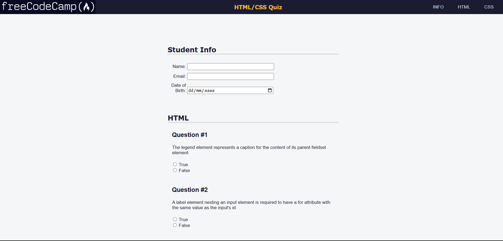

# 📋 Questionnaire
​
Welcome to the **Questionnaire** repository! This project consists of a simple and responsive questionnaire website, developed with **HTML5** and **CSS3**. The goal is to practice creating accessible and visually pleasing forms, which are essential for collecting user feedback on websites and web applications.​

## Layout

    

## 📋 Features

- **Questionnaire Form:** Includes fields for name, email, age, multiple choice options and a text area for comments, allowing users to provide detailed feedback.

- **Responsive Layout:** Adapts to different screen sizes, ensuring a good experience on mobile devices and desktops.

- **Clean and Intuitive Design:** Uses a soft color palette and readable typography to facilitate reading and navigation.​

## 🛠️ Technologies Used

- **HTML5:** Semantic structuring of the page content.

- **CSS3:** Responsive form styling and layout.